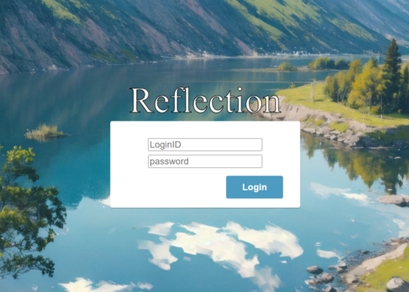
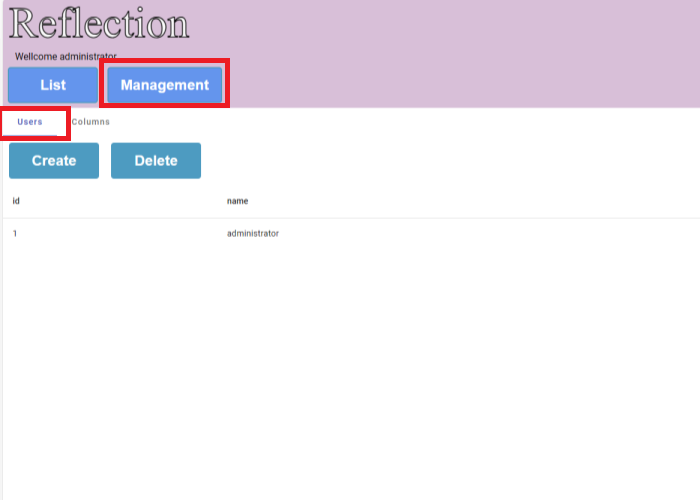
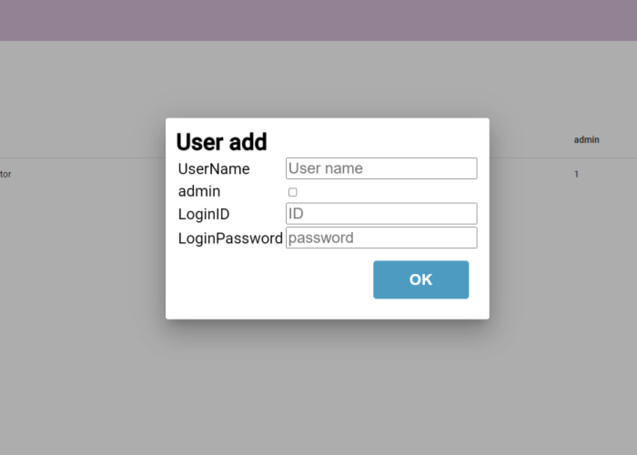
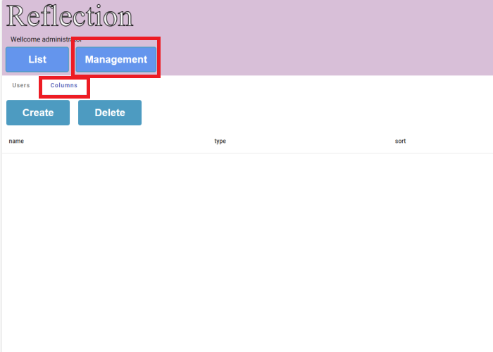
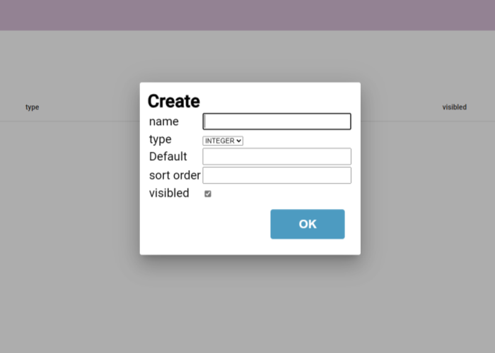
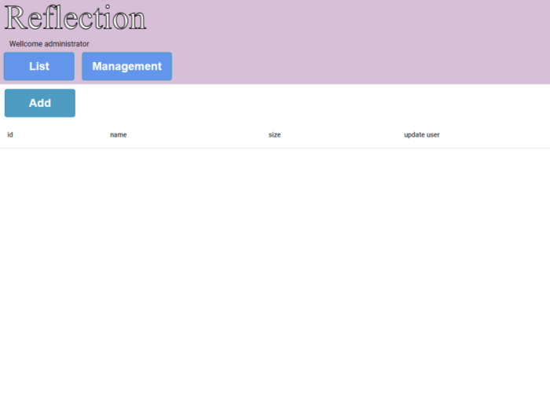
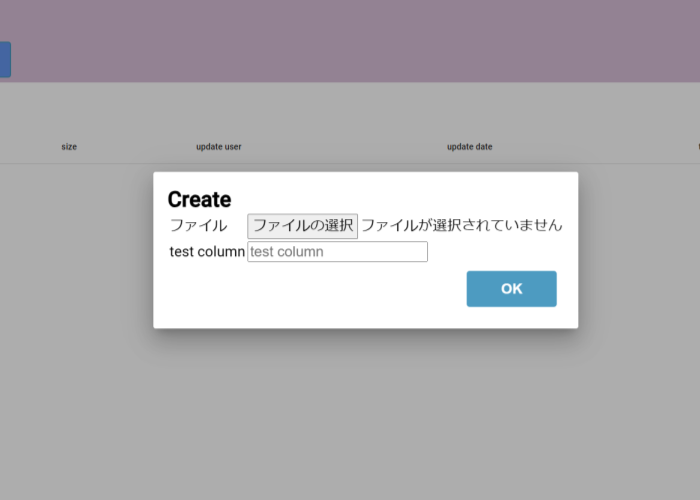
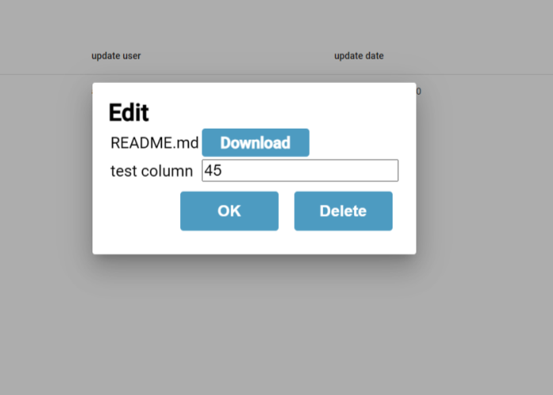

# Reflection
Reflectionはブラウザ上で動作するシンプルなファイル管理システムです。  
ファイルの実体およびファイルの追加情報を保持、管理を行うことができます。  
追加カラムを登録することで任意の情報を管理できます。

Reflection is a simple file management application.
It works with a web browser.  
You can upload any files and add custom infomation to it files.  
English usage is last of document.


## Usage
そのまま実行できるようにdockerファイルおよびcomposeを用意しました。  
以下の手順で使用可能です。


### DcokerBuild
以下のコマンドを実行してソースをcloneし、docker imageを作成してコンテナを起動してください。
```
$ git clone https://github.com/sulkmqul/Reflection
$ cd Reflection
$ docker compose build
$ docker compose up
```

### Access
webブラウザを開き、以下のアドレスを入力します。  
[http://localhost:8880/reflection](http://localhost:8880/reflection)



デフォルトアカウントは以下です。
Login ID | password
---|---
admin|#reflection 

ログインしたら一覧が表示されます。

### ユーザー追加


以下の手順でユーザーを作成します。　　
* Managementボタンを押します。
* Usersタブを選択します。
* Createボタンを押し、必要な項目を入力します。  

* OKボタンを押して登録します。

### カラム追加
  

以下の手順で追加のカラムを登録します。  
* Managementボタンを押します
* Columnsタブを選択します。
* Createボタンを押し、必要な項目を入力します。  

  * name:表示名
  * type:型
  * sort order:昇順
  * visibled:表示可否
* OKボタンを押して登録します。


### ファイルアップロード

  

以下の手順でファイルをアップロードできます。
* Listを選択しまｓ。
* Addボタンを押します。
* 必要な項目を入力します。  
    
  * Additional Columnsは必須入力です。


### 編集とファイルダウンロード
以下の手順でアップロードしたファイルをダウンロードできます。
* Listを選択します。
* 一覧から対象をダブルクリックします。
* 表示される画面よりDownloadボタンを押してファイルをダウンロードできます。  
  
* OKボタンを押すと編集情報をアップロードします。
* Deleteボタンを押すと対象を削除できます。


## Settings
自分で動かす時は、以下のファイルの設定値を変更してください。  
* Server  
src/server/refconfig.py
* Client  
src/client/ReflectionApp/src/assets/config.js


worker数はdocker-compose.yamlを開いて調整してください。  
1～4ぐらいが良いと思います。
それ以上の大規模なシステムの場合は別のものを使った方が良いかもしれません。


## Build
### server
* Python 3.8
  * FastAPI 0.11
  * sqlite3
* Uvicorn 

### client
* node 20.11
  * Angular 17.2
  * Angular Material 17

## Author 
sulkmqul  
[Blog](http://blog.livedoor.jp/serialpath/)


## LICENSE
[WTFPL](http://www.wtfpl.net/)  


## Usage in english
I wrote dockerfile and docker compose file.  
run below command.
```
$ git clone https://github.com/sulkmqul/Reflection
$ cd Reflection
$ docker compose build
$ docker compose up
```
Open your web browser, and move to following URL.  
[http://localhost:8880/reflection](http://localhost:8880/reflection)

Default account is below.  
Input this ID when first time accesses.
Login ID | password
---|---
admin|#reflection 


### User Add
Push Management button and select Users tab.  
Push Create button, you can make new user.  


### Columns Add
Push Management button and select columns tab.  
Push Create button, you can make new columns for file list.


### File manage
Push List button, and Add Button, you can upload new file in system.  
Double click list items, you can download file, and edit or delete.

  


### Settings
If you are not using a Dockerfile, please change these files.
* Server  
src/server/refconfig.py
* Client  
src/client/ReflectionApp/src/assets/config.js

if you change Uvicorn workers, change docker compose file.
Recommend workes num 1 to 4. 

